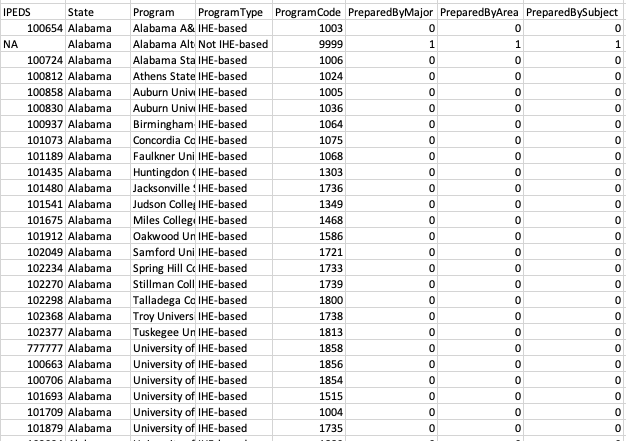
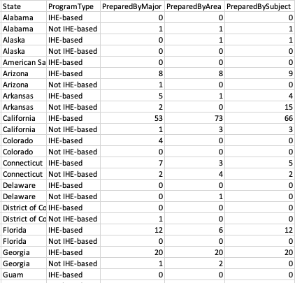
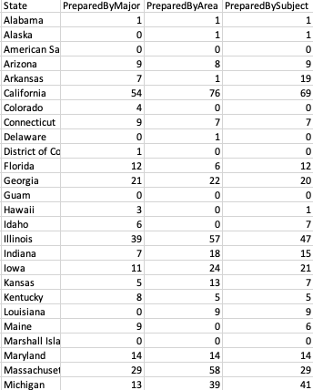
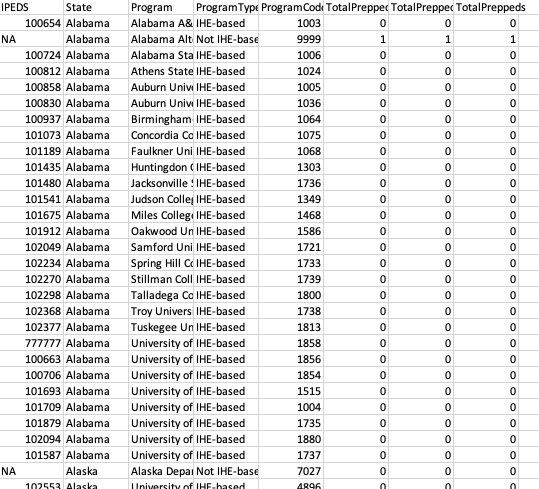

# PhysicsEdCoalition

 

This R package is designed for the Physics Teacher Education Coalition(PTEC). The purpose is to simplify the way of gathering the physics program completer counts from the Title II website(https://title2.ed.gov/Public/Home.aspx). I have detailed the functions and what they do as well as simple troubleshooting. Please submit an issue if you have any problems.

 

##Functions

 

Keep in mind all of these functions require the argument of 'Year' to function(enter whichever year of data you are looking for)

 

####ByProgram(Year, with_summary) 

 

This function will provide a row of counts for each program nationally(e.g. University of Arizona, Clemson University, etc.). It also provides other basic descriptive columns and the columns for the each of the counts of those prepared by major, prepared by area, and prepared by subject. 

 

 

####ByProgramType(Year, with_summary)

 

This function will provide a row of the counts of those prepared by major, those prepared by area, and those prepared by subject for each program type(IHE-based and not IHE-based) for each state.

 

 

####ByState(Year, with_summary)

 

This function will provide a row of the counts of those prepared by major, those prepared by area, and those prepared by subject for each state. 

 

 

####PrepData(Year)

 

This function is insignificant for use to the PTEC as its intention is only to prepare data for the other functions. Essentially, it's very similar to ByProgram() with a few differences.

 

 

####PhysicsEdData(Year, ByProgram, ByProgramFileName, ByProgramType, ByProgramTypeFileName, ByState, ByStateFileName)

 

This function creates a csv file of whichever function your looking for. Answering TRUE to any of the arguments ByState, ByProgram and ByProgramType in the function will create that table for you. Additionally, using the arguments that end in FileName will let you name that file.

 

##Downloading

To download the package you will need to use devtools:

install.packages('devtools')
library(devtools)

Then you can download the PhysicsEdData package with:

install_github('lvjensen/PhysicsEdData')

##Troubleshooting

The biggest problems I ran into while trying to download the package were involving downloaded packages. Before you download this ackage, I recommend you update every package on your machine. You can do this with the following:

update.packages()

However, you could still have problems downloading due to some packages not updating correctly. The most common problems are rlang and digest, however it can happen to others. You'll need to go to their location on your computer and delete them, then reinstall them in RStudio. You can find these packages in the following places depending on your system:

Windows: C:/Program Files/R/R-3.2.2/library/<package name>
Mac: /Library/Frameworks/R.framework/Resources/library/<package name>

To find this all on a website, go to https://lvjensen.github.io/PhysicsEdCoalition/
